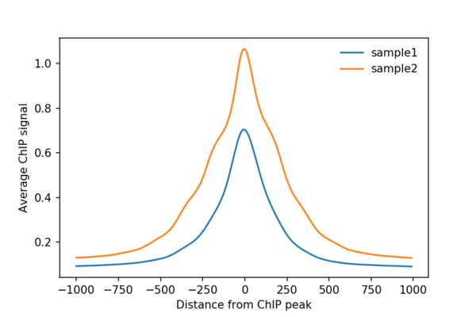
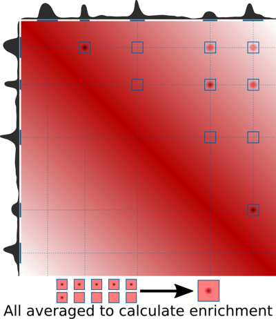
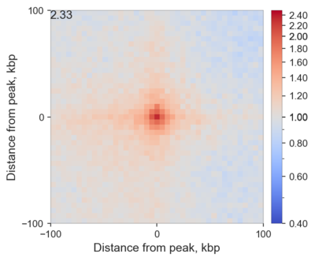
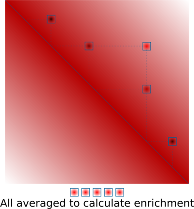
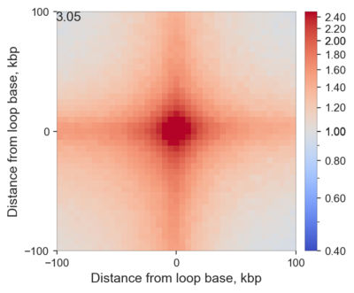

# Guide to pileup analysis

Coolpup.py is a tool for pileup analysis. But what are pile-ups?

If you don't know, you might have seen average ChIP-seq or ATAC-seq profiles which look something like this:

Pile-ups in Hi-C are essentially the same as average profiles, but in 2 dimensions, since
Hi-C data is a a matrix, not a linear track!

Therefore instead of a linear plot, pileups are usually represented as heatmaps - by mapping values of different pixels in the average matrix to specific colours.

## Pile-ups of interactions between a set of regions

For example, we can again start with ChIP-seq peaks, but instead of averaging ChIP-seq data around them, combine them with Hi-C data and check whether these regions are often found in proximity to each other. The algorithm is simple: we find intersections of all peaks in the Hi-C matrix (with some padding around the peak), and average them. If the peaks often interact, we will detect an enrichment in the center of the average matrix:

Here is a real example:

Here I averaged all (intra-chromosomal) interactions between highly enriched ChIP-seq peaks of RING1B in mouse ES cells. I added 100 kbp padding to each bin containing the peak, and since I used 5 kbp resolution Hi-C data, the total length of each side of this heatmap is 205 kbp. I also normalizes the result by what we would expect to find by chance, and therefore the values indicate observed/expected enrichment. Because of that, the colour is log-scaled, so that the neutral grey colour corresponds to 1 - no enrichment or depletion, while red and blue correspond to value above and below 1, respectively.

What is important, is that in the center we see higher values than on the edges: this means that regions bound by RING1B tend to stick together more, than expected! The actual value in the central pixel is displayed on top left for reference.

This analysis is the default mode when coolpup.py is run with a .bed file, e.g. ``coolpup.py my_hic_data.cool my_protein_peaks.bed`` (with optional ``--expected my_hic_data_expected.tsv`` - see details below).

## Pile-ups of predefined regions pairs, e.g. loops

A similar approach is based on averaging predefined 2D regions corresponding to interactions of specific pairs of regions. A typical example would be averaging loop annotations. This is very useful to quantify global perturbations of loop strength (e.g. annotate loops in WT, compare their strength in WT vs KO of an architectural protein), or to quantify them in data that are too sparse, such as single-cell Hi-C.
The algorithm is very simple:

And here is a real example of CTCF-associated loops in ES cells:

Comparing with the previous example, you can clearly see that if you average loops that have been previously identified you, of course, get much higher enrichment of interactions, than if you are looking for a tendency of some regions to interact.

This analysis is performed with coolpup.py when instead of a bed file you provide a .bedpe file, so simply ``coolpup.py my_hic_data.cool my_loops.bedpe`` (with optional ``--expected my_hic_data_expected.tsv`` - see details below). bedpe is a simple tab-separated 6-column file with chrom1, start1, end1, chrom2, start2, end2.